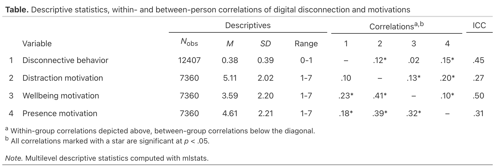

<!-- README.md is generated from README.Rmd. Please edit that file -->

```{r, include = FALSE}
knitr::opts_chunk$set(
  collapse = TRUE,
  comment = "#>",
  fig.path = "man/figures/README-",
  out.width = "100%"
)
```

# mlstats </a>

<!-- badges: start -->
[](https://github.com/felixdidi/mlstats/actions/workflows/R-CMD-check.yaml)
<!-- badges: end -->

The **mlstats** package provides tools for conducting multilevel analyses, such as centering variables to compute random effects within-between (REWB) models or creating publication-ready descriptive tables, including within-group and between-group correlations, as well as intraclass correlation coefficients (ICCs). The package supports both frequentist (using `lme4`) and Bayesian (using `brms`) estimation methods.

## Installation

You can install the development version of mlstats from GitHub:

```r
# install.packages("pak")
pak::pak("felixdidi/mlstats")
```

## Usage

### Multilevel Descriptives

The `mldesc()` function makes it easy to compute descriptive statistics for multilevel data, including basic descriptives (mean, SD, range), within-group and between-group correlations, as well as intraclass correlation coefficients (ICCs). Let's attempt to recreate Table 1 from Klingelhoefer et al. (2024):

```{r data, echo = FALSE, message = FALSE}
library(dplyr)
data <-
  read.csv("https://files.de-1.osf.io/v1/resources/486aq/providers/osfstorage/669e9f8b11532c02b2b35b21") |> 
  filter(compliance >= .6) |> 
  mutate(
    person = id,
    disconnective_behavior = disco_m,
    distraction_motivation = motivation_distraction,
    wellbeing_motivation = motivation_wellbeing,
    presence_motivation = motivation_presence,
    .keep = "none"
  )
```

```{r example}
library(mlstats)

vars <- c(
  "disconnective_behavior",
  "distraction_motivation",
  "wellbeing_motivation",
  "presence_motivation"
)

data |>
  mldesc(
    group = "person",
    vars = vars,
    remove_leading_zero = FALSE
  )
```


### Weighting by Group Size

By default, `mldesc()` weights the group means, standard deviations, and between-group correlations by group size. This can be disabled by setting `weight = FALSE` (e.g., so that each person in the sample contributes equally to the overall mean as well as to the between-person correlations):

```{r no-weight-example}
data |>
  mldesc(
    group = "person",
    vars = vars,
    weight = FALSE,
    remove_leading_zero = FALSE
  )
```

### Pretty Tables

By setting `print_gt = TRUE`, it is also easy to create a nicely formatted table that looks great in your Quarto document and can be directly copied into a manuscript. Here, we use the default setting of `remove_leading_zero = TRUE` to comply with APA formatting guidelines:

```{r gt-example, eval = FALSE}
data |> 
  mldesc(
    group = "person",
    vars = vars,
    print_gt = TRUE,
    table_title = "Descriptive statistics, within- and between-person correlations of digital disconnection and motivations"
  )
```

```{r gt-example-rendered, echo = FALSE, message = FALSE}
data |> 
  mldesc(
    group = "person",
    vars = vars,
    print_gt = TRUE,
    table_title = "Descriptive statistics, within- and between-person correlations of digital disconnection and motivations"
  ) |> 
    gt::gtsave("man/img/gt-example.png")
```



### Centering

We can also simply center variables for further use with the `decompose_within_between()` function. This centering approach is commonly used in multilevel modeling to separate within-group and between-group variance components (Enders & Tofighi, 2007). The decomposed variables are particularly useful for Random Effects Within-Between (REWB) models (Bell et al., 2019), which allow the estimation of distinct within-group and between-group effects.

```{r decompose-example}
data |>
  rename(disco = disconnective_behavior) |>
  decompose_within_between(
    group = "person",
    vars = "disco"
  ) |>
  select(person, matches("disco"))
```

### Bayesian Estimation

If you really want to do this, the package also supports Bayesian estimation via `brms`, providing credible intervals instead of *p*-values through `bayes_mldesc()` and `bayes_within_between_correlations()`. In addition to the parameters available in the frequentist functions, users must specify the credible interval width (`ci`) and a folder to save the fitted models (`folder`).

Note that the Bayesian functions may take a considerable amount of time to run (and use a considerable amount of disc space for model files) because they fit one `brms`-model per correlation coefficient.

## References

Bell, A., Fairbrother, M., & Jones, K. (2019). Fixed and random effects models: Making an informed choice. *Quality & Quantity, 53*(2), 1051–1074. https://doi.org/10/gd8wcr

Enders, C. K., & Tofighi, D. (2007). Centering predictor variables in cross-sectional multilevel models: A new look at an old issue. *Psychological Methods, 12*(2), 121–138. https://doi.org/10/b2jz57

Klingelhoefer, J., Gilbert, A., & Meier, A. (2024). Momentary motivations for digital disconnection: An experience sampling study. *Journal of Computer-Mediated Communication, 29*(5), zmae013. https://doi.org/10/hbb5gx

