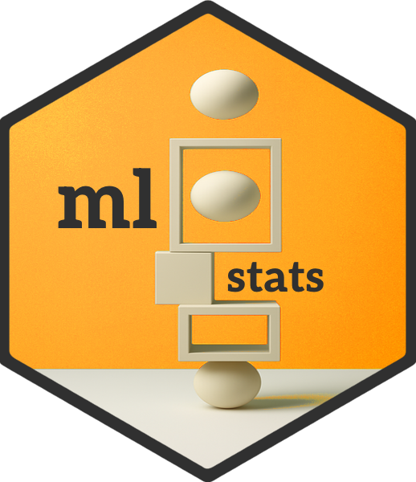

<!-- README.md is generated from README.Rmd. Please edit that file -->

# mlstats </a>

<!-- badges: start -->
[](https://github.com/felixdidi/mlstats/actions/workflows/R-CMD-check.yaml)
[](https://app.codecov.io/gh/felixdidi/mlstats)
<!-- badges: end -->

The **mlstats** package provides tools for multilevel descriptive statistics and data preparation. It computes within-group and between-group correlations (via variance decomposition or two-level structural equation modeling), intraclass correlation coefficients (ICCs), and descriptive statistics for nested data (e.g., repeated measurements per person), supporting both frequentist (via `lme4` or `lavaan`) and Bayesian (via `brms`) estimation. Results are formatted according to APA standards and can be exported as tables using `gt` or `tinytable`. The package also includes functions for decomposing variables into within-group and between-group components for use in Random Effects Within-Between (REWB) models.

## Installation

You can install mlstats from CRAN:

```r
install.packages("mlstats")
```

You can also install the development version from GitHub:

```r
# install.packages("pak")
pak::pak("felixdidi/mlstats")
```

## Overview

**mlstats** is built around two main tasks:

- **Multilevel descriptives**: `mldesc()` computes means, standard deviations, ranges, ICCs, and a combined within-/between-group correlation matrix in a single call.
- **Variable decomposition**: `decompose_within_between()` splits time-varying predictors into within-group deviations (situational fluctuations) and between-group means (stable differences), ready for use in REWB models.

## Example

This example uses the simulated `media_diary` dataset included with **mlstats**. It mimics a study in which 100 participants completed brief daily surveys for 14 consecutive days (*N* = 100 persons, *T* = 1,400 daily observations).

```{r mldesc, warning = FALSE}
library(mlstats)
data("media_diary")

media_diary |>
  mldesc(
    group = "person",
    vars = c("self_control", "wellbeing", "screen_time", "stress")
  )
```

## Learning more

mlstats comes with documentation vignettes to help you get started:

* Learn a **best practice workflow** in `vignette("mlstats")`.
* Learn how to **report multilevel descriptive statistics** in `vignette("multilevel-descriptives")` and how to transform them into **publication-ready multilevel descriptive tables** in `vignette("tables")`. 
* Learn how to use decomposed variables and interpret effects in **Random Effects Within-Between (REWB)** models in `vignette("rewb-models")`.
* Learn about the different frequentist **estimation approaches** for within- and between-group correlations in `vignette("correlation-methods")`, or how to use **Bayesian estimation** in `vignette("bayesian-estimation")`.

## References

Bell, A., Fairbrother, M., & Jones, K. (2019). Fixed and random effects models: Making an informed choice. *Quality & Quantity, 53*(2), 1051–1074. https://doi.org/10.1007/s11135-018-0802-x

Enders, C. K., & Tofighi, D. (2007). Centering predictor variables in cross-sectional multilevel models: A new look at an old issue. *Psychological Methods, 12*(2), 121–138. https://doi.org/10.1037/1082-989X.12.2.121

Pedhazur, E. J. (1997). *Multiple regression in behavioral research: Explanation and prediction* (3rd ed.). Harcourt Brace.
