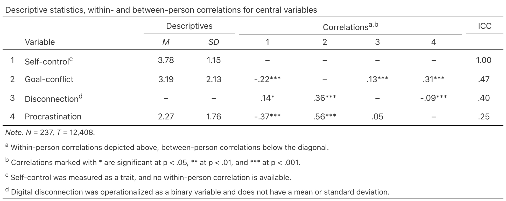

<!-- README.md is generated from README.Rmd. Please edit that file -->

# mlstats </a>

<!-- badges: start -->

[](https://github.com/felixdidi/mlstats/actions/workflows/R-CMD-check.yaml)
[](https://app.codecov.io/gh/felixdidi/mlstats)
<!-- badges: end -->

The **mlstats** package provides tools for multilevel descriptive
statistics and data preparation. It computes within-group and
between-group correlations (via variance decomposition or two-level
structural equation modeling), intraclass correlation coefficients
(ICCs), and descriptive statistics for nested data (e.g., repeated
measurements per person), supporting both frequentist (via `lme4` or
`lavaan`) and Bayesian (via `brms`) estimation. Results are formatted
according to APA standards and can be exported as tables using `gt` or
`tinytable`. The package also includes functions for decomposing
variables into within-group and between-group components for use in
Random Effects Within-Between (REWB) models.

## Installation

You can install mlstats from CRAN:

``` r
install.packages("mlstats")
```

You can also install the development version from GitHub:

``` r
# install.packages("pak")
pak::pak("felixdidi/mlstats")
```

## Decompose Within- and Between-Group Effects

You can easily center variables with the `decompose_within_between()`
function. This centering approach is commonly used in multilevel
modeling (Enders & Tofighi, 2007). The decomposed variables are
particularly useful for Random Effects Within-Between (REWB) models
(Bell et al., 2019), which allow the estimation of distinct within-group
and between-group effects. By default, all three components are computed
— grand mean centering (`gmc`), group means (`between`), and
within-group deviations (`within`) — but any subset can be selected via
the `components` argument. The names of the resulting columns can be
customized using `gmc_pattern`, `between_pattern`, and `within_pattern`.

``` r
data |>
  decompose_within_between(
    group = "person",
    vars = c("procrastination", "disconnection")
  ) |>
  glimpse()
#> Rows: 12,408
#> Columns: 11
#> $ person                              <int> 1, 1, 1, 1, 1, 1, 1, 1, 1, 1, 1, 1…
#> $ self_control                        <dbl> 2.5, 2.5, 2.5, 2.5, 2.5, 2.5, 2.5,…
#> $ goal_conflict                       <int> 5, 4, 4, 3, 2, 1, 1, 1, 1, 1, 1, 1…
#> $ disconnection                       <int> 1, 0, 0, 0, 0, 0, 0, 0, 0, 0, 0, 0…
#> $ procrastination                     <int> 4, 5, 6, 7, 3, 4, 3, 2, 1, 1, 1, 1…
#> $ procrastination_grand_mean_centered <dbl> 1.7253385, 2.7253385, 3.7253385, 4…
#> $ disconnection_grand_mean_centered   <dbl> 0.4068343, -0.5931657, -0.5931657,…
#> $ procrastination_between_person      <dbl> 3.510204, 3.510204, 3.510204, 3.51…
#> $ disconnection_between_person        <dbl> 0.02040816, 0.02040816, 0.02040816…
#> $ procrastination_within_person       <dbl> 0.4897959, 1.4897959, 2.4897959, 3…
#> $ disconnection_within_person         <dbl> 0.97959184, -0.02040816, -0.020408…
```

## Multilevel Descriptives

### Easy Defaults

You can also easily compute descriptive statistics for multilevel data.
`mldesc()` outputs basic descriptives, ICCs, as well as within-group and
between-group correlations for a set of variables, given a grouping
variable (e.g., person ID). If desired, the
`within_between_correlations()` function computes only a correlation
matrix without additional descriptives.

``` r
vars <- c(
  "self_control",
  "goal_conflict",
  "disconnection",
  "procrastination"
)

data |>
  mldesc(
    group = "person",
    vars = vars
  )
#> # Multilevel Descriptive Statistics
#>   =============== ====== ===== ===== ===== ===== ===== ===== ===== =====
#>   variable         n_obs     m    sd range   `1`   `2`   `3`   `4`   icc
#>   --------------- ------ ----- ----- ----- ----- ----- ----- ----- -----
#> 1 Self control    12,408  3.78  1.15   2–7     –    NA    NA    NA  1.00
#> 2 Goal conflict   12,408  3.19  2.13   1–7 -.22*     –  .13*  .31*   .47
#> 3 Disconnection   12,408  0.59  0.49   0–1  .14*  .36*     – -.09*   .40
#> 4 Procrastination 12,408  2.27  1.76   1–7 -.37*  .56*   .05     –   .25
#>   =============== ====== ===== ===== ===== ===== ===== ===== ===== =====
#> # ℹ Within-group correlations above, between-group correlations below the
#> #   diagonal.
#> # ℹ All correlations marked with a star are significant at p < .05.
#> # ℹ Correlations estimated via variance decomposition.
#> # ℹ Group-weighted multilevel descriptive statistics computed with mlstats.
```

### Estimation Method and Weighting

Two estimation methods are available via the `method` argument. The
default `method = "decomposition"` uses a fast, closed-form
variance-decomposition approach (Pedhazur, 1997): within-group
correlations are computed from group-mean-centered residuals and
between-group correlations from the group means. Alternatively,
`method = "sem"` fits a two-level structural equation model via `lavaan`
using robust maximum likelihood, which handles very unequal group sizes
more rigorously for significance testing. By default (`weight = TRUE`),
between-group correlations and descriptives are weighted by group size;
set `weight = FALSE` to give every group equal influence regardless of
size. Note that `weight` is only available for
`method = "decomposition"`. See `vignette("correlation-methods")` for a
detailed comparison.

### Customizable Options

Further options to customize the output:

- **Remove leading zeros**: By default, `mldesc()` removes leading zeros
  from decimal numbers to comply with APA formatting guidelines. This
  can be disabled by setting `remove_leading_zero = FALSE`.
- **Flip correlation matrix**: By default, within-group correlations are
  displayed above the diagonal and between-group correlations below the
  diagonal. This can be changed by setting `flip = TRUE`.
- **Significance stars**: By default, one star is added to all
  correlation coefficients with *p* \< .05. By setting
  `significance = "detailed"`, this can be changed to one star for *p*
  \< .05, two stars for *p* \< .01, and three stars for *p* \< .001.

``` r
data |>
  mldesc(
    group = "person",
    vars = vars,
    weight = FALSE,
    remove_leading_zero = FALSE,
    flip = TRUE,
    significance = "detailed"
  )
#> # Multilevel Descriptive Statistics
#>   =============== ====== ===== ===== ===== ===== ======== ======== ========
#>   variable         n_obs     m    sd range   `1`      `2`      `3`      `4`
#>   --------------- ------ ----- ----- ----- ----- -------- -------- --------
#> 1 Self control    12,408  3.78  1.16   2–7     – -0.22***    0.13* -0.36***
#> 2 Goal conflict   12,408  3.22  1.48   1–7    NA        –  0.37***  0.56***
#> 3 Disconnection   12,408  0.60  0.32   0–1    NA  0.13***        –     0.06
#> 4 Procrastination 12,408  2.29  0.90   1–7    NA  0.31*** -0.09***        –
#>   =============== ====== ===== ===== ===== ===== ======== ======== ========
#> # ℹ 1 more variable: icc <mls>
#> # ℹ Between-group correlations above, within-group correlations below the
#> #   diagonal.
#> # ℹ Correlations marked with * are significant at p < .05, ** at p < .01, and
#> #   *** at p < .001.
#> # ℹ Correlations estimated via variance decomposition.
#> # ℹ Unweighted multilevel descriptive statistics computed with mlstats.
```

### Pretty Printing

The `mldesc()` function supports various print-methods that can be
accessed by passing its output to `print()`. All printing methods allow
customization of the `table_title`, `correlation_note`,
`significance_note`, and `note_text`. Whereas the default print method
prints to the console, a `tinytable` object is returned when setting
`format = "tt"` and a `gt` object is returned when setting
`format = "gt"`. Please note that the `gt` package is rather large and
therefore not installed together with `mlstats` by default. It must be
installed separately by calling `install.packages("gt")`.

The `gt` format is particularly useful for creating publication-ready
tables for manuscripts, as it supports rich text formatting and many
customization options. The `tinytable` format is a lightweight
alternative that is included in `mlstats` by default. It can be easily
converted to other formats such as HTML, PDF, or Microsoft Word. For
example, the output can be rendered directly into a Microsoft Word
document using [Quarto](https://quarto.org/).

```` default
---
format: docx
---

```{r}
data |>
  mldesc(
    group = "person",
    vars = vars
  ) |>
  print(format = "tt")
```
````

All outputs are designed to look great by default — however, users can
further customize the output by modifying the resulting `tibble`, `gt`,
or `tt` object (for customization of `gt` tables, see the documentation
[here](https://gt.rstudio.com/); for tinytable, see
[here](https://vincentarelbundock.github.io/tinytable/)). For example,
to reproduce Table 1 from Klingelhoefer et al. (2026), we can adjust the
output by selecting relevant columns, replacing `NA`s with dashes, and
adding footnotes:

``` r
data |>
  mldesc(group = "person", vars = vars, significance = "detailed") |>
  select(-n_obs, -range) |>
  mutate(across(everything(), ~ str_replace(.x, "NA", "–"))) |>
  mutate(across(any_of(c("m", "sd")), ~ if_else(variable == "Disconnection", "–", .x))) |>
  mutate(variable = case_when(variable == "Self control" ~ "Self-control<sup>c</sup>", variable == "Goal conflict" ~ "Goal-conflict", variable == "Disconnection" ~ "Disconnection<sup>d</sup>", variable == "Procrastination" ~ "Procrastination")) |>
  print(
    format = "gt",
    table_title = "Descriptive statistics, within- and between-person correlations for central variables",
    correlation_note = "Within-person correlations depicted above, between-person correlations below the diagonal.",
    note_text = "<i>Note</i>. <i>N</i> = 237, <i>T</i> = 12,408."
  ) |>
  gt::tab_source_note(source_note = gt::html("<sup>c</sup> Self-control was measured as a trait, and no within-person correlation is available.")) |>
  gt::tab_source_note(source_note = gt::html("<sup>d</sup> Digital disconnection was operationalized as a binary variable and does not have a mean or standard deviation.")) |>
  gt::fmt_markdown(columns = variable)
```



### Pipe-Friendly Output

Although the main purpose of the package is to enable user-friendly
creation of publication-ready tables, the output of both `mldesc()` and
the underlying `within_between_correlations()` are tibbles with vectors
of class `mlstats_stat` (or short, `mls`). These tibbles can be used for
subsequent calculations by casting the contents to useful types such as
`numeric` (this will remove significance stars and other formatting).
For example, the output of `within_between_correlations()` can be used
to identify the largest within-person correlation in the dataset:

``` r
cors <-
  data |>
  within_between_correlations(
    group = "person",
    vars = vars
  )

cors |>
  mutate(across(-variable, as.numeric)) |> 
  rename_with(~ cors$variable, .cols = -variable) |>
  pivot_longer(-variable) |>
  rename(v1 = variable, v2 = name) |>
  group_by(v1) |>
  mutate(type = if_else(row_number() > which(is.na(value)), "wp", "bp")) |>
  ungroup() |>
  filter(type == "wp") |> 
  filter(value == max(value))
#> # A tibble: 1 × 4
#>   v1            v2              value type 
#>   <chr>         <chr>           <dbl> <chr>
#> 1 goal_conflict procrastination  0.31 wp
```

## Bayesian Estimation

If desired, the package also supports Bayesian estimation via `brms`,
providing credible intervals instead of *p*-values through
`bayes_mldesc()` and `bayes_within_between_correlations()`. In addition
to the parameters available in the frequentist functions, users must
specify a folder to save the fitted models (`folder`). The credible
interval width can be set via `ci` (default: 0.9 for a 90% CI).

Note that the Bayesian functions may take a considerable amount of time
to run (and use a considerable amount of disc space for model files)
because they fit one `brms`-model per correlation coefficient. Sampling
settings can be adjusted globally via
`options(mlstats.brms_iter = ..., mlstats.brms_chains = ...)`, with
defaults of 5000 iterations and 4 chains.

## References

Bell, A., Fairbrother, M., & Jones, K. (2019). Fixed and random effects
models: Making an informed choice. *Quality & Quantity, 53*(2),
1051–1074. <https://doi.org/10.1007/s11135-018-0802-x>

Enders, C. K., & Tofighi, D. (2007). Centering predictor variables in
cross-sectional multilevel models: A new look at an old issue.
*Psychological Methods, 12*(2), 121–138.
<https://doi.org/10.1037/1082-989X.12.2.121>

Klingelhoefer, J., Gilbert, A., & Meier, A. (2026). Digital
disconnection as a self-regulatory strategy against procrastination.
*Scientific Reports, 16*, 17133.
<https://doi.org/10.1038/s41598-026-46218-1>

Pedhazur, E. J. (1997). *Multiple regression in behavioral research:
Explanation and prediction* (3rd ed.). Harcourt Brace.
